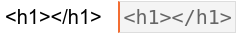

# code-formatter
A simple addon for Anki to format code snippets for better visualization (it doesn't use [pygments](http://pygments.org/) or something like this though, so don't expect keywords highlighting).

Works nicely with [Night Mode](https://github.com/krassowski/Anki-Night-Mode) addon.

Example:

Usage:

Just select the text and press 
 to format/deformat accordingly (yep, having two buttons for a togglable task is too much, but I haven't figured out how to make it **nicely**).